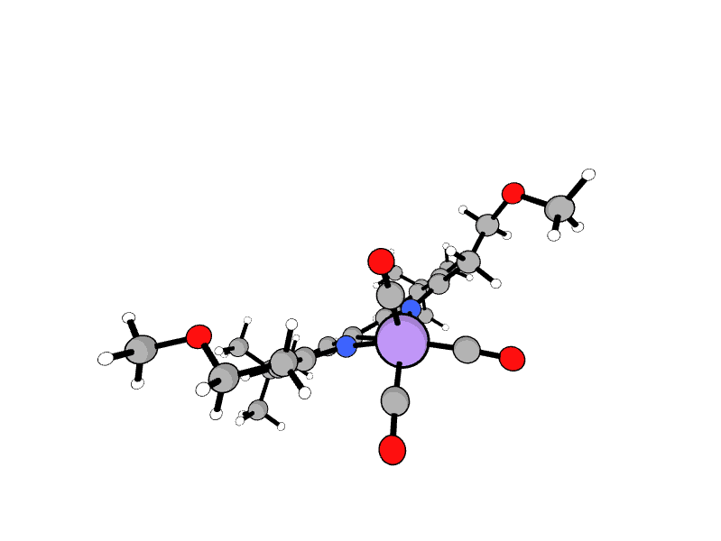

# 🧬 Molecule Aligner

A powerful Python package for creating complex molecular reaction pathways by seamlessly combining trajectory alignment, interpolation, and frame manipulation in a single, intuitive API.

<p align="center">
  
</p>


## 🚀 Overview

Molecule Aligner enables computational chemists to build sophisticated molecular reaction mechanisms from diverse sources - existing MD trajectories, single molecular structures, and interpolated transition paths. Whether you're studying catalytic cycles, protein conformational changes, or drug binding mechanisms, Molecule Aligner provides the tools to create smooth, chemically accurate reaction pathways.


## 🔧 Installation

```bash
# direct installation
pip install git+https://github.com/kangmg/molecule_aligner.git

# git clone
git clone https://github.com/kangmg/molecule_aligner.git
cd molecule_aligner
pip install -e .
```


## 🎯 Quick Start

### Basic Reaction Pathway

```python
from molecule_aligner import build_reaction_pathway

# Create a complete reaction pathway with mixed inputs
pathway = build_reaction_pathway(
    steps=[
        # Interpolate initial approach
        {
            'type': 'interpolate',
            'from': 'reactant.xyz',
            'to': 'intermediate.xyz',
            'frames': 15,
            'method': 'idpp'
        },
        
        # Use existing MD trajectory  
        {
            'type': 'trajectory',
            'source': 'reaction_dynamics.traj',
            'frames': 'all',
            'reverse': False
        },
        
        # Final product formation
        {
            'type': 'interpolate', 
            'from': 'intermediate.xyz',
            'to': 'product.xyz',
            'frames': 12,
            'method': 'idpp'
        }
    ],
    base_indices=[0, 1, 2, 3, 4, 5],  # Atoms for alignment
    output_path='complete_reaction.extxyz'
)

print(f"Generated pathway: {len(pathway)} frames")
```

### Catalytic Cycle Example

```python
# Complex catalytic mechanism
catalytic_cycle = build_reaction_pathway(
    steps=[
        # Substrate binding
        {'type': 'interpolate', 'from': 'catalyst.xyz', 'to': 'bound.xyz', 'frames': 20, 'method': 'idpp'},
        
        # Reaction dynamics (MD trajectory)  
        {'type': 'trajectory', 'source': 'reaction_md.traj', 'frames': [100, 300], 'skip': 2},
        
        # Hold at transition state
        {'type': 'frame', 'source': 'transition_state.xyz', 'repeat': 5},
        
        # Product release
        {'type': 'interpolate', 'from': 'product_bound.xyz', 'to': 'catalyst.xyz', 'frames': 15, 'method': 'idpp'}
    ],
    base_indices=list(range(20)),
    output_path='catalytic_cycle.extxyz'
)
```

## 🎮 Step Types

Molecule Aligner supports three fundamental step types for maximum flexibility:

### `interpolate` - Smooth Transitions
Create chemically accurate transitions between molecular structures using IDPP or linear methods.

### `trajectory` - Existing Simulations  
Incorporate MD trajectories, conformational sampling, or any multi-frame molecular data.

### `frame` - Static States
Add checkpoints, static periods, or important intermediate structures.

> 📚 **For complete step reference and advanced examples, see [GUIDE.md](GUIDE.md)**


## 📁 Input/Output Formats

### Supported Inputs
- ASE trajectory files (`.traj`)
- XYZ files (`.xyz`) 
- Any ASE-supported format
- Direct `Atoms` objects
- Lists of `Atoms` objects


## 🎓 Documentation

- **[GUIDE.md](GUIDE.md)** - Complete step reference and advanced examples
- **[Example Notebook](example_usage.ipynb)** - Run in colab


---

**Ready to build your molecular pathways? Check out [GUIDE.md](GUIDE.md) for detailed examples!** 🚀
